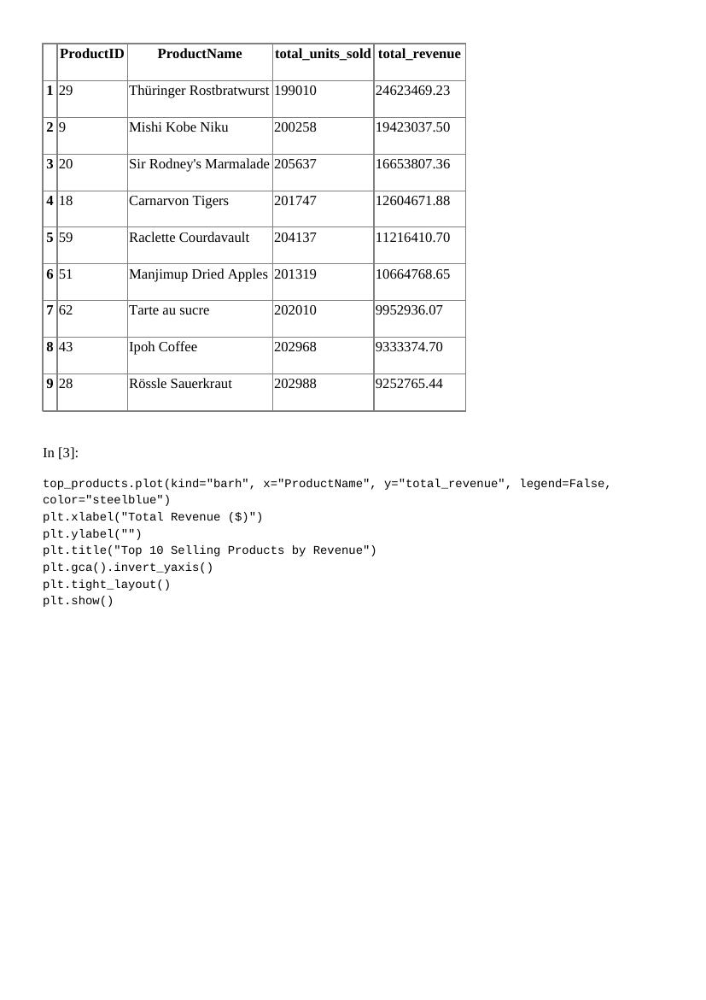
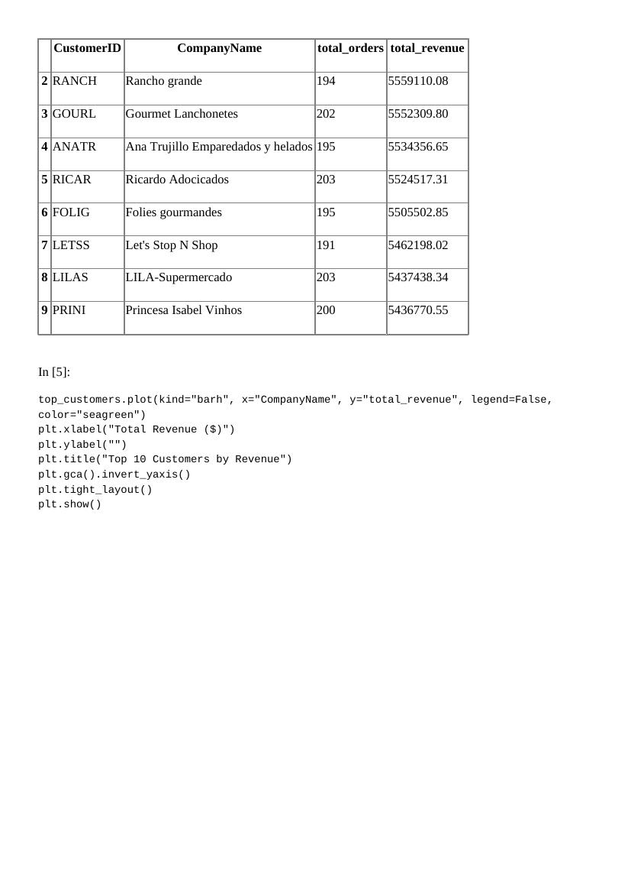
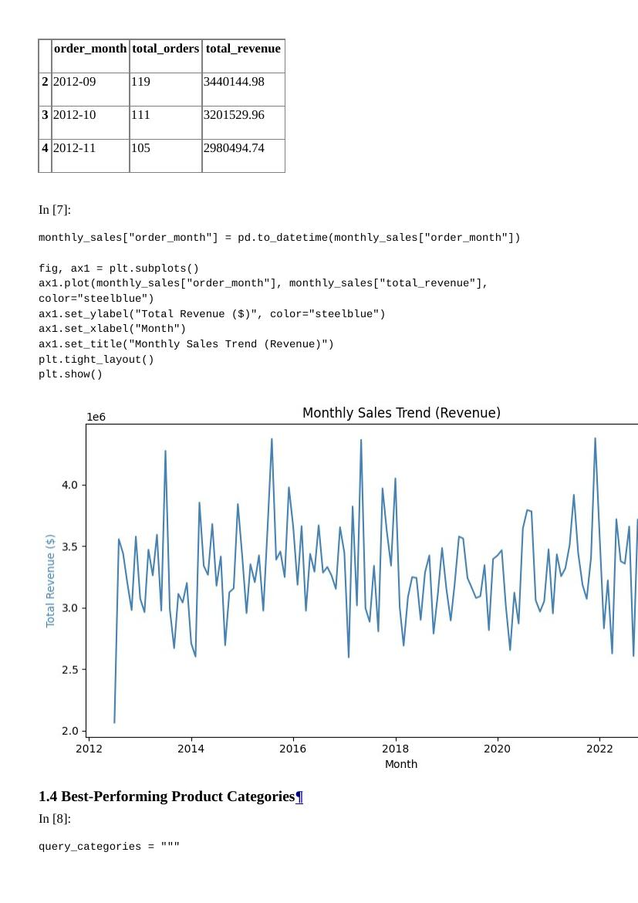
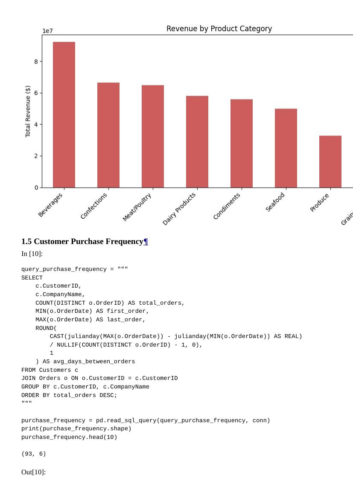

# Assignment 2: Northwind Database — SQL Analysis & Pandas Exploration

## Database Overview

**Dataset:** [Northwind Database](https://github.com/jpwhite3/northwind-SQLite3) (SQLite3 version of Microsoft's classic Northwind sample database)

Northwind models a small import/export business: customers place orders, orders contain line
items (`Order Details`) for specific products, products belong to categories and are sourced from
suppliers, and orders are shipped by carriers. The database used here (`northwind.db`) contains:

- **91 customers**, **13,000+ orders** spanning **2012-07 to 2023-10**
- **77 products** across **8 categories**
- Standard supporting tables: `Employees`, `Shippers`, `Suppliers`, `Territories`, `Regions`

Revenue throughout this analysis is calculated per order line item as:
`UnitPrice × Quantity × (1 − Discount)`.

## Business Questions

1. What are the top 10 selling products by revenue?
2. Who are the top 10 customers by revenue?
3. How do monthly sales trend over time?
4. Which product categories perform best?
5. How frequently do customers purchase (orders count and average days between orders)?

## SQL Output Screenshots

**Top 10 Products by Revenue**

**Top 10 Customers by Revenue**

**Monthly Sales Trend**

**Category Performance & Purchase Frequency**

## Key Insights

1. **Revenue is not evenly spread across products — a handful of items dominate.** *Côte de Blaye*
   alone generates over $53M in revenue, roughly double the next-highest product, even though unit
   sales across the top 10 products are fairly similar (~200,000 units each). High-value premium
   items drive disproportionate revenue relative to volume.

2. **Customer revenue is fairly evenly distributed among top accounts, not winner-take-all.** The
   top 10 customers each contribute a similar revenue range ($5.4M–$6.2M) and together account for
   only **12.5%** of total company revenue ($448M) — a healthy, diversified customer base rather
   than dependence on a few "whale" accounts.

3. **Beverages is the top-performing category by a clear margin**, generating ~$92M (20.6% of all
   revenue) — well ahead of Confections (14.8%) and Meat/Poultry (14.5%). Grains/Cereals and
   Produce are the weakest categories (6.4% and 7.3%) despite comparable unit volumes, suggesting
   lower per-unit price points.

4. **Purchase frequency and order spacing are tightly linked** (correlation ≈ **-0.99** between
   total orders and average days between orders). The most active customers order roughly every
   19-21 days. This relationship is a natural basis for an "at-risk of churn" flag: a customer
   whose current gap since their last order exceeds their historical average spacing.

5. **Monthly revenue fluctuates without one dominant trend direction**, generally ranging
   $2.9M–$3.6M per month. Grouping by calendar month (regardless of year) shows revenue is
   somewhat higher in December ($3.58M avg) and May ($3.54M avg) than in February ($2.92M avg),
   a useful starting point for a more formal seasonality analysis.

## Repository Contents

- `queries.sql` — the 5 core SQL queries (top products, top customers, monthly trends, category
  performance, purchase frequency)
- `analysis.ipynb` — runs all queries via `sqlite3`/Pandas, adds exploratory analysis and charts,
  and documents the insights above
- `northwind.db` — the SQLite database used
- `screenshots/` — SQL output screenshots referenced above
- `README.md` — this file
