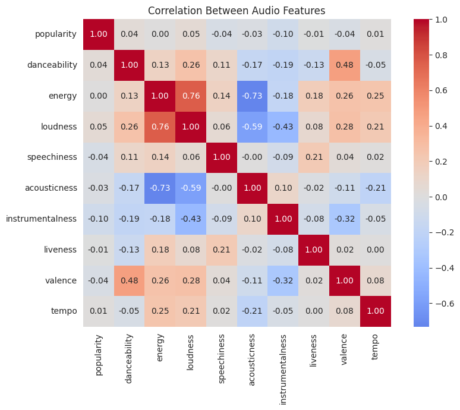
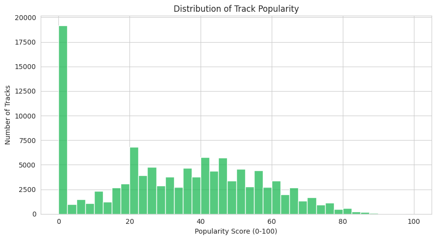
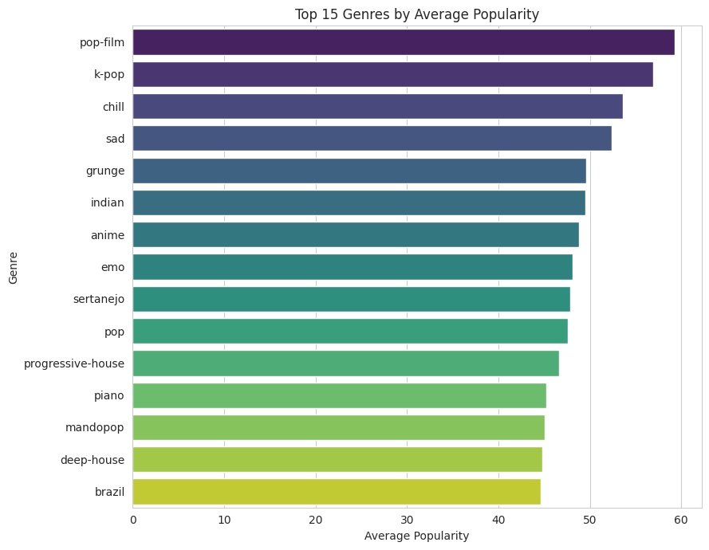
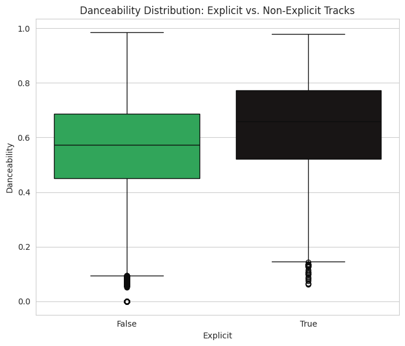
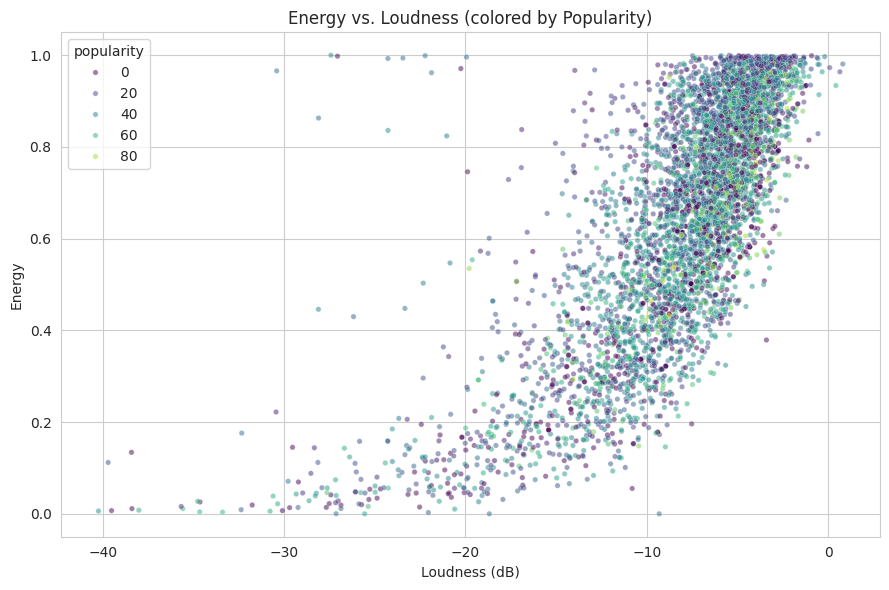
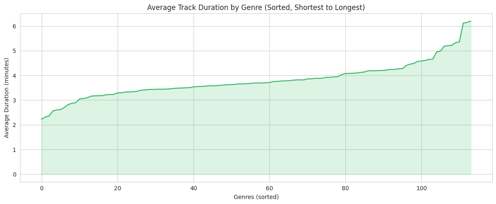
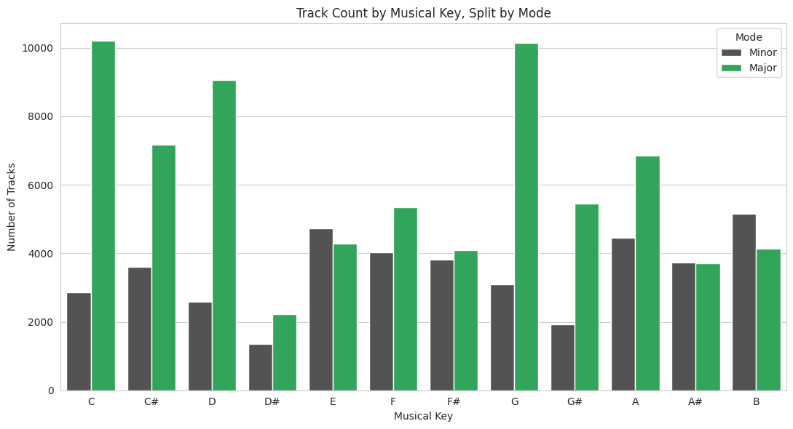

# Assignment 4: Spotify Tracks Dataset — EDA & Data Storytelling

## Dataset Overview

**Dataset:** [Spotify Tracks Dataset](https://www.kaggle.com/datasets/maharshipandya/-spotify-tracks-dataset) (Kaggle)

The dataset contains **114,000 rows** across **20 columns**, covering **114 music genres**
(~1,000 tracks per genre). Each row is a (track, genre) pairing — the same song can appear
multiple times if Spotify tags it under more than one genre — giving **89,741 unique tracks** in
total. Columns include identifying info (`track_id`, `artists`, `album_name`, `track_name`,
`track_genre`), popularity, and 10 numeric audio features from Spotify's API (`danceability`,
`energy`, `loudness`, `speechiness`, `acousticness`, `instrumentalness`, `liveness`, `valence`,
`tempo`, `key`, `mode`, `time_signature`).

**Data quality notes found during EDA:**
- Only 1 row has missing values (`artists`, `album_name`, `track_name` — and that same row also
  has `duration_ms = 0`, an evident data entry error).
- 450 fully duplicated rows, and 24,259 rows sharing a `track_id` with another row (same song
  tagged under multiple genres — expected given the dataset's structure, not an error).

## Visualizations

**Correlation Heatmap — Audio Features**

**1. Distribution of Track Popularity (Histogram)**

*Insight:* Popularity is heavily skewed toward the low end, with over 16,000 tracks scoring
exactly 0. Very few tracks reach 80+, showing that a small fraction of songs capture most
listener attention.

**2. Top 15 Genres by Average Popularity (Bar Chart)**

*Insight:* *Pop-film*, *k-pop*, and *chill* top the rankings. Mainstream, culturally-driven genres
outperform niche or technical genres — cultural reach matters as much as the music itself.

**3. Danceability by Explicit Content Flag (Box Plot)**

*Insight:* Explicit tracks have a higher median danceability (0.66) than non-explicit tracks
(0.57), consistent with explicit content concentrating in rhythm-driven genres like hip-hop.

**4. Energy vs. Loudness, colored by Popularity (Scatter Plot)**

*Insight:* Energy and loudness move together in a clear positive relationship (r ≈ 0.76).
Popularity (color) doesn't concentrate in any one region, showing loudness/energy alone don't
guarantee popularity.

**5. Average Track Duration by Genre, Sorted (Line Chart)**

*Insight:* Average duration ranges from ~2.2 minutes (*grindcore*, *children*, *study*) to over 6
minutes (*chicago-house*, *minimal-techno*, *detroit-techno*) — genre strongly shapes expected
song length.

**6. Track Count by Musical Key, Split by Mode (Bar Chart)**

*Insight:* Major-key tracks outnumber minor-key tracks roughly 64% to 36%. C, G, and D are the
most common keys — likely reflecting their ease on guitar and piano, the most common songwriting
instruments.

## Overall Conclusions

1. **Popularity is extremely skewed and zero-inflated** — any predictive model built on this data
   needs to handle the large cluster of zero-popularity tracks explicitly, not assume a normal
   distribution.
2. **Genre predicts popularity far better than any single audio feature.** No individual feature
   (danceability, energy, valence, etc.) correlates strongly with popularity (all |r| < 0.1), but
   average popularity spans a 57-point range across genres (pop-film at 59.3 vs. iranian at 2.2).
3. **Audio features cluster in musically sensible, internally consistent ways** — energy and
   loudness rise together (r ≈ 0.76), while acousticness falls as energy rises (r ≈ -0.73),
   validating the reliability of Spotify's extracted audio features.
4. **The dataset is structured per (track, genre), not per unique song** — with 114,000 rows but
   only 89,741 unique tracks, track-level analysis requires deduplicating on `track_id` first.
5. **Well-known songwriting conventions show up clearly at scale**, from the dominance of major
   keys and guitar/piano-friendly keys to the link between explicit content and higher
   danceability — confirming the dataset's audio features reflect real musical patterns.

## Repository Contents

- `visualization.ipynb` — full EDA, 6 visualizations across 4+ chart types, and written insights
- `README.md` — this file
- `screenshots/` — exported chart images referenced above
