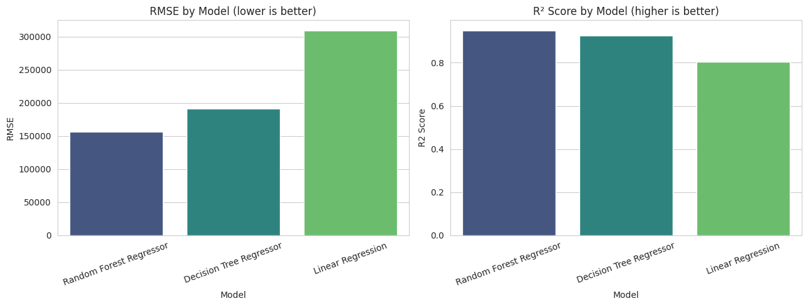
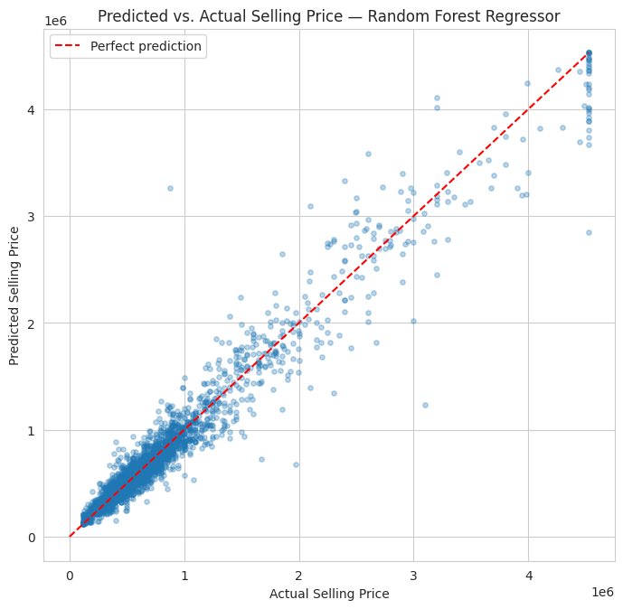
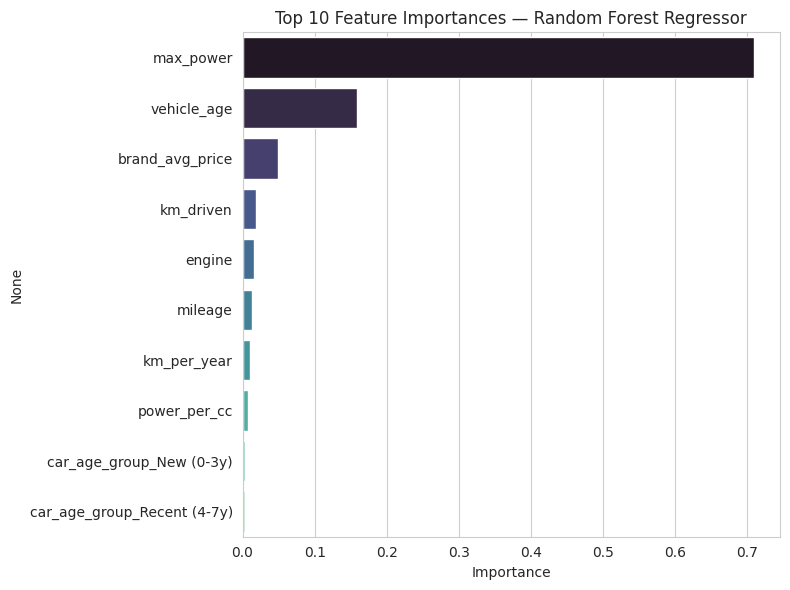

# Assignment 5: CarDekho Used Car Price Prediction

## Business Objective

CarDekho (and any used-car marketplace or dealership) needs to quickly and fairly estimate a
selling price for a used car based on its characteristics. An accurate pricing model helps sellers
price competitively, helps buyers avoid overpaying, and builds trust through consistent valuations.
This project builds and compares regression models to predict a used car's `selling_price`.

## Dataset Overview

**Dataset:** [CarDekho Used Car Dataset](https://www.kaggle.com/datasets/manishkr1754/cardekho-used-car-data) (Kaggle)

- **15,411 rows, 13 columns**, no missing values, **167 fully duplicated rows** (removed)
- Covers **32 brands** and **120 models**, with `selling_price` ranging from ₹40,000 to
  ₹3.95 crore and `km_driven` from 100 to 3,800,000 km

## Features and Target Variable

**Target:** `selling_price` (continuous, INR) → **regression** problem

| Type | Features |
|---|---|
| Numerical | `vehicle_age`, `km_driven`, `mileage`, `engine`, `max_power`, `seats` |
| Categorical | `brand`, `model`, `seller_type`, `fuel_type`, `transmission_type` |

`car_name` is dropped as redundant with `brand` + `model`.

## Data Preparation

- **Missing values:** none found — no imputation needed.
- **Duplicates:** 167 fully duplicated rows removed.
- **Outliers:** `selling_price` (9.0% beyond IQR bounds) and `km_driven` (3.0% beyond IQR bounds)
  were **capped at the 1st/99th percentile** rather than dropped, since extreme-but-genuine luxury
  cars and high-mileage vehicles are real market data the model should still learn to price.
- **Feature engineering (5 new features):** `car_age_group` (bucketed age), `power_per_cc`
  (`max_power / engine`), `km_per_year` (usage intensity independent of age), `brand_avg_price`
  (target-encoded brand, computed leakage-safely from the training set only), `is_luxury_brand`
  (premium-brand flag).
- **Encoding:** one-hot encoding for `seller_type`, `fuel_type`, `transmission_type`,
  `car_age_group`; `brand` replaced by its leakage-safe target encoding to avoid a 30+ column
  expansion.
- **Scaling:** `StandardScaler` applied to all numeric features — necessary for Linear Regression
  (feature scale affects its coefficients), harmless for the tree-based models.
- **Split:** 80/20 train/test split (12,195 train rows, 3,049 test rows).

## Regression Models Implemented

1. Linear Regression
2. Decision Tree Regressor (`max_depth=10`)
3. Random Forest Regressor (`n_estimators=200`, `max_depth=15`)

## Performance Comparison

| Model | MAE (₹) | MSE | RMSE (₹) | R² Score |
|---|---:|---:|---:|---:|
| **Random Forest Regressor** | **89,085** | 2.45 × 10¹⁰ | **156,411** | **0.9497** |
| Decision Tree Regressor | 103,967 | 3.66 × 10¹⁰ | 191,414 | 0.9246 |
| Linear Regression | 185,140 | 9.58 × 10¹⁰ | 309,500 | 0.8030 |

## Best-Performing Model: Random Forest Regressor

Random Forest achieved the lowest error and highest R² (0.95) by averaging many decision trees
trained on bootstrapped samples and random feature subsets. This captures the strongly non-linear
relationships between features like `max_power`, `engine`, and `brand_avg_price` and price, while
reducing the overfitting risk a single Decision Tree is prone to. Linear Regression trails well
behind (R² = 0.80) because it can only fit a straight-line relationship, which doesn't match how
car depreciation and premium-brand pricing actually behave.

**Top feature importances (Random Forest):** `max_power` (71.0%), `vehicle_age` (15.9%),
`brand_avg_price` (5.0%), with `km_driven`, `engine`, and `mileage` contributing smaller shares.

## Strengths & Limitations by Model

**Linear Regression** — simplest, most interpretable, fastest to train; but assumes a linear
price relationship that doesn't hold well for cars (e.g., depreciation isn't constant per year).

**Decision Tree Regressor** — captures non-linear relationships and interactions automatically,
easy to visualize as rules; but a single tree overfits easily and is unstable to small data changes.

**Random Forest Regressor** — best accuracy of the three by averaging many trees to reduce
variance, and provides feature importances; but slower to train/predict and less directly
interpretable than a single tree or linear model.

## Key Observations

- `max_power` is by far the strongest single predictor of price (71% of Random Forest's feature
  importance), consistent with its 0.75 raw correlation with `selling_price`.
- `vehicle_age` and `mileage` both correlate negatively with price, as expected — older, more
  driven cars sell for less.
- Outliers in `selling_price` and `km_driven` were real, legitimate market values (luxury cars,
  high-use vehicles), so capping rather than deleting preserved the full 15,244-row training set.
- Target-encoding `brand` avoided a 32-column one-hot explosion while still letting brand
  reputation meaningfully inform price predictions.

## Future Improvements

1. **Hyperparameter tuning** with `GridSearchCV`/`RandomizedSearchCV` for Random Forest's
   `n_estimators`, `max_depth`, `min_samples_leaf`.
2. **Try gradient-boosted models** (XGBoost, LightGBM, `GradientBoostingRegressor`), which often
   outperform Random Forest on tabular data.
3. **Target-encode `model`** (currently dropped for cardinality) to recover within-brand price
   variation.
4. **Log-transform `selling_price`** before training to reduce the influence of very expensive
   cars and better satisfy Linear Regression's assumptions.

## Repository Contents

- `car_price_prediction.ipynb` — full workflow: problem framing, data preparation, model
  development, evaluation, and comparison
- `README.md` — this file
- `screenshots/` — exported chart images referenced above
