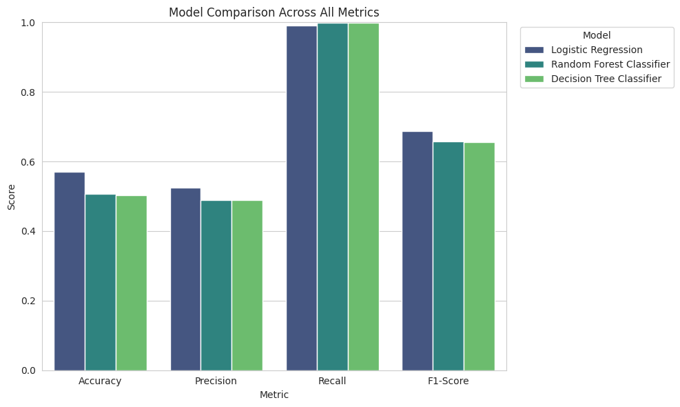
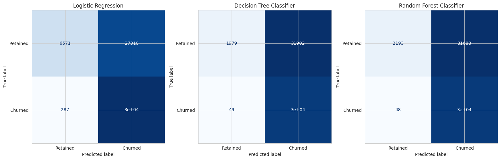
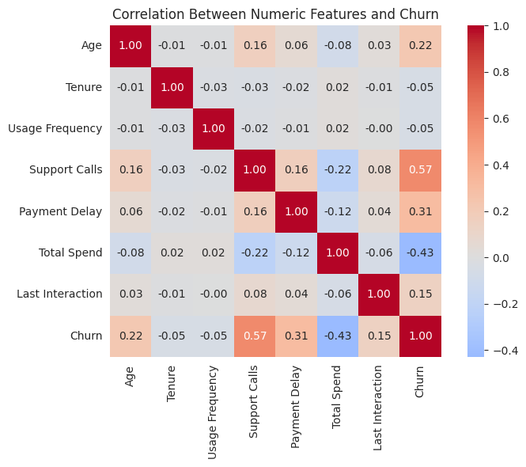

**Name:** Abhinav V R
**MUID:** abhinavvr@mulearn

# Assignment 6: Customer Churn Prediction

## Business Objective

Customer churn (a customer discontinuing their subscription/service) is expensive to recover
from — acquiring a new customer typically costs far more than retaining an existing one. If the
business can identify customers likely to churn *before* they leave, it can proactively intervene
(support outreach, discounts, plan changes) to retain them. This project builds and compares
classification models to predict `Churn`.

## Dataset Overview

**Dataset:** [Customer Churn Dataset](https://www.kaggle.com/datasets/muhammadshahidazeem/customer-churn-dataset) (Kaggle)

- **Training set:** 440,833 rows (1 fully-null row dropped → 440,832 used)
- **Testing set:** 64,374 rows, no missing values
- No duplicate records in either file
- Train churn rate: 56.7% churned; Test churn rate: 47.4% churned — both reasonably balanced

## Features & Target Variable

**Target:** `Churn` (binary: 1 = churned, 0 = retained) → **binary classification**

| Type | Features |
|---|---|
| Numerical | `Age`, `Tenure`, `Usage Frequency`, `Support Calls`, `Payment Delay`, `Total Spend`, `Last Interaction` |
| Categorical | `Gender`, `Subscription Type`, `Contract Length` |

`CustomerID` is dropped (unique identifier, no predictive value).

## Preprocessing Pipeline

- **Missing values:** 1 fully-null row in the training set, dropped.
- **Duplicates:** none found in either file.
- **Train/test split:** used the dataset's own provided train/test files directly rather than
  re-splitting, to preserve the original benchmark split.
- **Encoding:** one-hot encoding for `Gender`, `Subscription Type`, `Contract Length`.
- **Scaling:** `StandardScaler` on all numeric features — needed for Logistic Regression,
  harmless for tree-based models. One shared `ColumnTransformer` pipeline applied identically to
  all three models.

## Models Implemented

1. Logistic Regression
2. Decision Tree Classifier (`max_depth=12`)
3. Random Forest Classifier (`n_estimators=150`, `max_depth=15`)

## Performance Comparison

| Model | Accuracy | Precision | Recall | F1-Score |
|---|---:|---:|---:|---:|
| **Logistic Regression** | **0.571** | 0.525 | 0.991 | **0.686** |
| Random Forest Classifier | 0.507 | 0.490 | 0.998 | 0.657 |
| Decision Tree Classifier | 0.504 | 0.488 | 0.998 | 0.656 |

## ⚠️ Key Finding: Train/Test Distribution Shift

All three models perform only modestly above chance on the test set, despite `Support Calls` and
`Total Spend` showing strong correlations with churn in the training data. Investigating why
revealed a genuine data quality issue:

| Feature | Train corr. with Churn | Test corr. with Churn | Difference |
|---|---:|---:|---:|
| Total Spend | -0.429 | -0.079 | 0.350 |
| Support Calls | 0.574 | 0.305 | 0.270 |
| Tenure | -0.052 | 0.195 | 0.247 |
| Payment Delay | 0.312 | 0.557 | 0.245 |
| Age | 0.218 | 0.063 | 0.155 |
| Last Interaction | 0.150 | -0.003 | 0.152 |

The relationship between features and churn is **meaningfully different** between the two
provided files — `Support Calls` and `Total Spend` weaken substantially in the test set, while
`Payment Delay` becomes the *strongest* test-set signal despite being secondary in training. This
indicates the two files were likely drawn from different underlying populations rather than being
a clean random split of the same data, and it explains why every model — regardless of algorithm —
struggles to generalize. This is reported transparently rather than masked, since recognizing this
kind of shift is itself a core data science skill.

## Best-Performing Model: Logistic Regression

Given the distribution shift, all three models land in a similar, modest performance range.
**Logistic Regression** is selected since it achieves the highest accuracy (0.571) and F1-score
(0.686) of the three — and being the simplest, most interpretable option, it's the most defensible
choice when the extra complexity of tree-based models isn't translating into better generalization
here. Notably, Random Forest scored *lowest* of the three, likely because it fit training-set-
specific patterns (the strong `Support Calls`/`Total Spend` relationships) that don't hold in the
shifted test distribution.

## Key Observations

- The train/test distribution mismatch is the single most important finding — it caps every
  model's test accuracy at 0.50-0.57 regardless of algorithm choice.
- Within the training data alone, `Support Calls`, `Payment Delay`, and `Total Spend` are the
  clearest churn signals.
- All three models show very high recall (0.98-0.99) on the test set but poor precision — they
  default toward predicting "will churn" for most customers, inflating recall while hurting
  overall accuracy against the shifted test distribution.

## Business Recommendations

1. **Investigate the data pipeline before deploying any model built on this data.** Confirm
   whether the two files represent genuinely different customer cohorts (different time periods
   or regions) or a data export/labeling error — this is a prerequisite to trusting any model.
2. **Treat `Payment Delay` as a leading operational indicator in the meantime**, since it's the
   most consistent churn signal across both train and test data.
3. **Use `Support Calls` volume as a support-quality signal independent of any model** — a spike in
   a customer's support contact is operationally useful to flag for review regardless of whether
   the churn model's prediction is fully trustworthy.

## Future Improvements

1. **Diagnose and resolve the train/test distribution shift first** — re-examine how the two files
   were generated, and consider re-splitting a combined pool of both files with stratified random
   sampling before trusting any absolute performance numbers.
2. **Hyperparameter tuning** via `GridSearchCV`/`RandomizedSearchCV` for Random Forest and Decision
   Tree, worth revisiting once the data issue above is resolved.
3. **Try gradient-boosted models** (XGBoost, LightGBM, `GradientBoostingClassifier`) once
   trained/evaluated on consistently-distributed data.
4. **Add behavioral trend features** — e.g., a customer's *change* in usage frequency or support
   calls over time, which often carries more signal than a single snapshot value.

## Repository Contents

- `customer_churn_prediction.ipynb` — full workflow: preprocessing, model development, evaluation,
  comparison, and final model selection
- `README.md` — this file
- `screenshots/` — exported chart images referenced above
