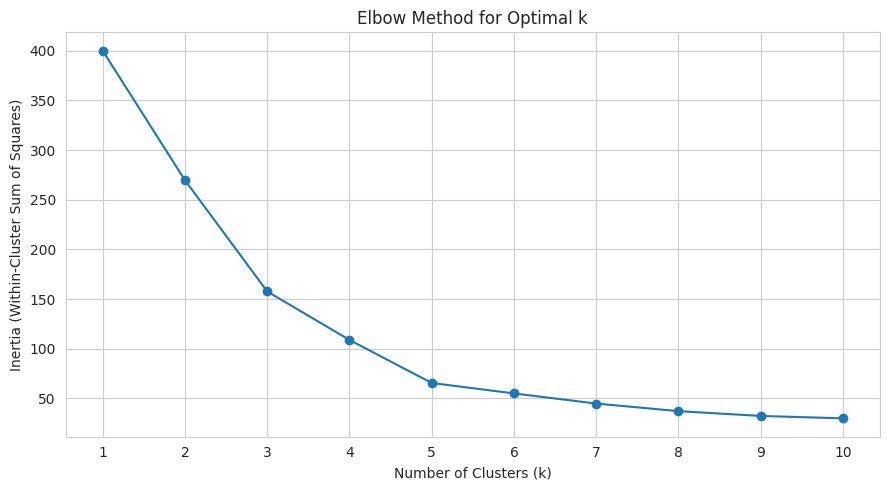
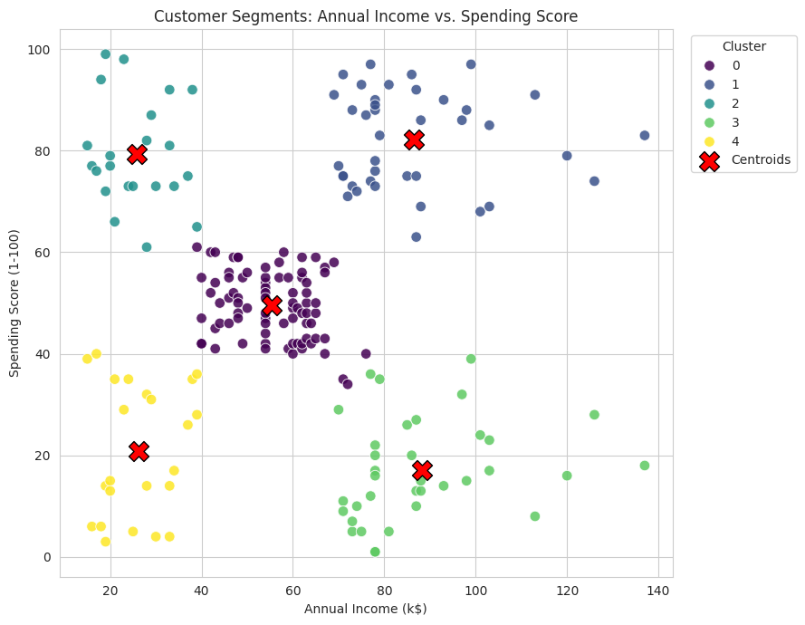
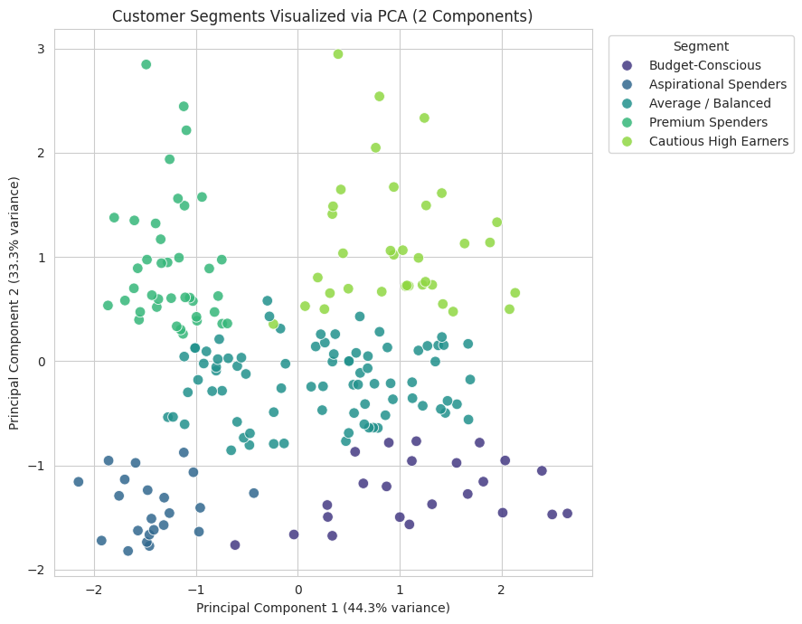

**Name:** Abhinav V R
**MUID:** abhinavvr@mulearn

# Assignment 7: Mall Customer Segmentation

## Project Summary

This project segments mall customers into meaningful groups using **K-Means clustering**, chooses
the number of clusters via the **Elbow Method**, visualizes the segments with **PCA**, and turns
each resulting cluster into a business-ready customer segment with a recommended strategy.

## Dataset Overview

**Dataset:** [Mall Customer Segmentation Dataset](https://www.kaggle.com/datasets/vjchoudhary7/customer-segmentation-tutorial-in-python) (Kaggle)

- **200 rows, 5 columns:** `CustomerID`, `Gender`, `Age`, `Annual Income (k$)`, `Spending Score (1-100)`
- No missing values, no duplicate records
- 112 Female / 88 Male customers; Age 18-70; Annual Income $15k-$137k; Spending Score 1-99

## Approach

1. **Data preparation** — confirmed no missing values or duplicates; encoded `Gender` numerically
   (used only for profiling, not primary clustering).
2. **Feature selection** — clustered on `Annual Income (k$)` and `Spending Score (1-100)`, since
   together they directly capture purchasing power and purchasing behavior, the two dimensions a
   mall most needs for targeted marketing.
3. **Feature scaling** — applied `StandardScaler` before clustering. K-Means relies on Euclidean
   distance to assign points to centroids; without scaling, `Annual Income` (range ~15-137) would
   dominate the distance calculation over `Spending Score` (range 1-99) purely due to its larger
   numeric scale, not because it's actually more important.
4. **Elbow Method** — fit K-Means for k = 1 to 10 and plotted inertia against k.
5. **Final K-Means model** — trained with the chosen k, assigned every customer to a cluster.
6. **PCA visualization** — reduced `Age`, `Annual Income`, and `Spending Score` to 2 principal
   components to visualize the clusters and report explained variance.
7. **Cluster profiling & naming** — assigned each cluster a business-friendly name based on its
   average income and spending score.

## Important Observations & Findings

### Elbow Method

Inertia drops sharply from k=1 through k=5 (400.0 → 65.6), then flattens out from k=5 onward
(marginal gains shrink to single digits). **k=5** is the clear elbow point.

### Cluster Profiles (k=5)

| Cluster | Segment Name | Count | Avg Age | Avg Income (k$) | Avg Spending Score | Female % |
|---|---|---:|---:|---:|---:|---:|
| 2 | Aspirational Spenders | 22 | 25.3 | 25.7 | 79.4 | 59.1% |
| 0 | Average / Balanced | 81 | 42.7 | 55.3 | 49.5 | 59.3% |
| 4 | Budget-Conscious | 23 | 45.2 | 26.3 | 20.9 | 60.9% |
| 3 | Cautious High Earners | 35 | 41.1 | 88.2 | 17.1 | 45.7% |
| 1 | Premium Spenders | 39 | 32.7 | 86.5 | 82.1 | 53.8% |

### PCA Results

- **PC1 explains 44.3%** of total variance, **PC2 explains 33.3%** — together, **77.6%** of the
  variance in `Age`, `Annual Income`, and `Spending Score` is captured in just 2 dimensions.
- **PC1** is driven almost entirely by `Age` and `Spending Score` (loadings of 0.71 and -0.71,
  moving in opposite directions) — an "age vs. spending behavior" axis.
- **PC2** is driven almost entirely by `Annual Income` (loading of 0.999) — essentially a pure
  "income" axis.
- Since clustering was based directly on income and spending score, the 5 segments remain clearly
  visually separated in the PCA projection.

## Business Insights & Segment Strategies

1. **Premium Spenders** (high income, high spending — 39 customers) — the mall's most valuable
   segment. *Strategy:* VIP loyalty programs, early access to new collections, premium in-mall
   experiences to maximize retention and lifetime value.

2. **Cautious High Earners** (high income, low spending — 35 customers) — strong purchasing power
   not currently converting into mall spending. *Strategy:* targeted promotions and curated
   recommendations to understand what's holding them back; highest-upside segment if engagement
   improves.

3. **Aspirational Spenders** (low income, high spending — 22 customers) — spend enthusiastically
   relative to income. *Strategy:* flexible payment options, loyalty points, and mid-range product
   lines that reward engagement without over-extending them financially.

4. **Budget-Conscious** (low income, low spending — 23 customers) — price-sensitive, minimal
   purchases. *Strategy:* value-focused promotions and discount events; less likely to respond
   profitably to premium marketing spend.

5. **Average / Balanced** (moderate income, moderate spending — 81 customers, the largest segment)
   — the "typical" mall customer without a strong distinguishing pattern. *Strategy:* broad
   seasonal marketing and general loyalty programs; monitor for drift toward other segments.

## Conclusions

- K-Means with **k=5** (chosen via the Elbow Method) cleanly separates mall customers into five
  visually and behaviorally distinct segments based on income and spending behavior.
- **Feature scaling was essential** for correct clustering, since `Annual Income`'s larger raw
  scale would otherwise have dominated distance calculations.
- **PCA confirms the segmentation is meaningful** even across a richer 3-feature space including
  `Age`, with income and spending behavior driving two largely independent axes of variation.
- The resulting segments translate directly into **actionable retention and marketing
  strategies** — from VIP treatment for Premium Spenders to value-focused promotions for the
  Budget-Conscious segment — rather than remaining abstract statistical groupings.

## Repository Contents

- `customer_segmentation.ipynb` — complete implementation: data prep, scaling, Elbow Method,
  K-Means, PCA, cluster profiling, and business insights
- `README.md` — this file
- `screenshots/` — exported chart images referenced above
