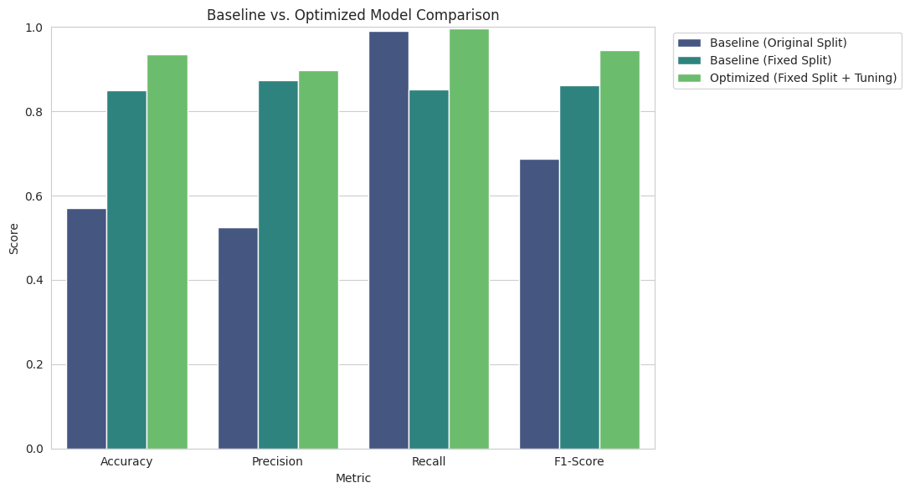
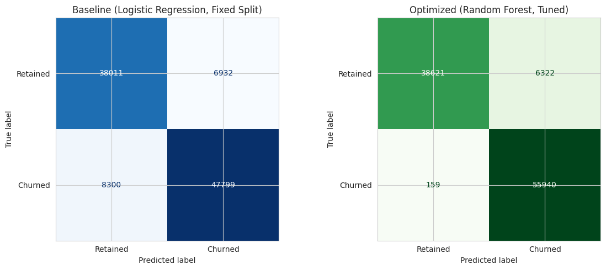
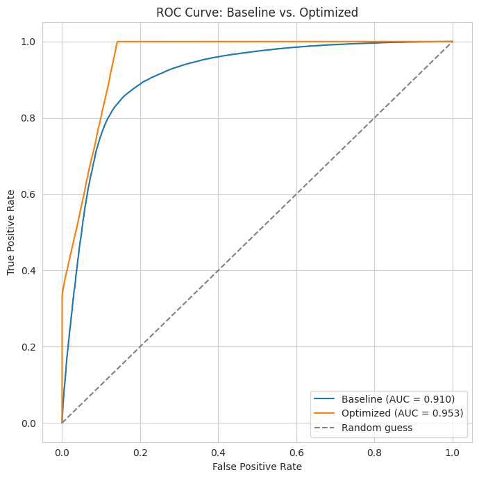
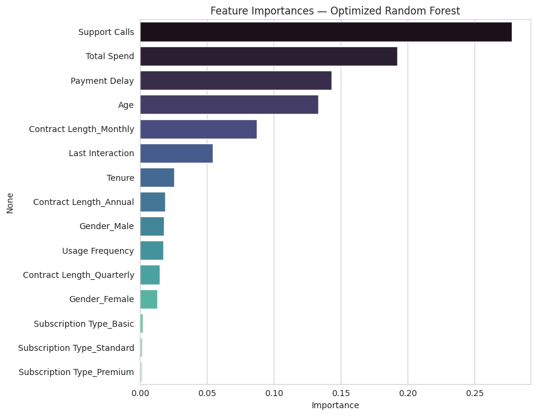

**Name:** Abhinav V R
**MUID:** abhinavvr@mulearn

# Assignment 8: Customer Churn Prediction — Model Optimization

## Project Summary

This project revisits the customer churn classification problem from Assignment 6 and focuses on
**optimization**: building a baseline model, diagnosing why it performed poorly, fixing the root
cause, then applying genuine model optimization (algorithm choice + hyperparameter tuning) and
comparing baseline vs. optimized results with standard classification metrics.

## Dataset Overview

**Dataset:** [Customer Churn Dataset](https://www.kaggle.com/datasets/muhammadshahidazeem/customer-churn-dataset) (Kaggle)

- **Training file:** 440,832 rows (after dropping 1 null row) | **Testing file:** 64,374 rows
- **Target:** `Churn` (binary: 1 = churned, 0 = retained)
- **Features:** `Age`, `Gender`, `Tenure`, `Usage Frequency`, `Support Calls`, `Payment Delay`,
  `Subscription Type`, `Contract Length`, `Total Spend`, `Last Interaction`

## Optimization Approach

### Step 1 — Establish and Diagnose the Baseline

A baseline **Logistic Regression** model, trained on the dataset's original provided train/test
files, achieved only **57.1% accuracy** — barely above chance — despite `Support Calls` and
`Total Spend` showing strong correlations with churn (0.57 and -0.43) in the training data.

Investigating why revealed a **train/test distribution mismatch**: those same features correlate
far more weakly with churn in the test file (0.30 and -0.08), while `Payment Delay` becomes the
*dominant* test-set signal (0.56) despite being secondary in training (0.31). The two provided
files are not a clean random split of the same population — no amount of hyperparameter tuning can
fix a model evaluated against data with a fundamentally different feature-target relationship.

### Step 2 — Fix the Data Split

Both files were pooled (505,206 rows total, no duplicates) and re-split with **stratified random
sampling** (80/20). This alone — with the *same* untuned Logistic Regression — improved accuracy
from **57.1% to 84.9%**, confirming the original weak performance was a data issue, not a modeling
issue. This became the true baseline for the optimization comparison.

### Step 3 — Optimize the Model

On the corrected split, a **Random Forest Classifier** was tuned via `RandomizedSearchCV`
(12 candidate configurations, 3-fold cross-validation, optimizing F1-score) over `n_estimators`,
`max_depth`, `min_samples_leaf`, and `min_samples_split`. The search ran on a stratified 20,000-row
subsample for speed, and the best configuration
(`n_estimators=200, max_depth=20, min_samples_leaf=1, min_samples_split=10`) was refit on the full
404,164-row training set.

## Performance Comparison

| Model | Accuracy | Precision | Recall | F1-Score | ROC-AUC |
|---|---:|---:|---:|---:|---:|
| Baseline (Original Split) | 0.5713 | 0.5252 | 0.9906 | 0.6864 | — |
| Baseline (Fixed Split) | 0.8493 | 0.8733 | 0.8520 | 0.8626 | 0.9095 |
| **Optimized (Fixed Split + Tuned RF)** | **0.9359** | **0.8985** | **0.9972** | **0.9452** | **0.9531** |

## Important Observations & Findings

- **The data split was the single biggest lever for performance** — fixing it improved accuracy by
  28 points, dwarfing the further ~9-point gain from switching models and tuning hyperparameters.
  Model optimization should always start by verifying the evaluation setup itself is sound.
- **The optimized Random Forest improves on every metric** over the fixed-split baseline,
  especially precision (0.873 → 0.899) and F1 (0.863 → 0.945), showing genuine value from a more
  expressive model once the underlying data is trustworthy.
- **`Support Calls` (27.9%), `Total Spend` (19.2%), and `Payment Delay` (14.3%)** are the top three
  feature importances in the optimized model — consistent with the correlation analysis, and
  together they account for over 60% of the model's decision-making weight.

## Model Improvements Summary

| Improvement | Effect |
|---|---|
| Diagnosed train/test mismatch instead of tuning blindly | Avoided wasted optimization effort on a broken setup |
| Pooled + stratified re-split | Accuracy: 0.571 → 0.849 (+27.8 pts) |
| Random Forest + `RandomizedSearchCV` tuning | Accuracy: 0.849 → 0.936 (+8.7 pts); F1: 0.863 → 0.945 |

## Conclusions

1. **Data quality issues can silently dominate model performance.** No modeling technique —
   however sophisticated — can outperform a fundamentally mismatched train/test split; diagnosing
   this first was the highest-leverage step in the entire optimization process.
2. **Once the data was fixed, a tuned Random Forest meaningfully outperformed a plain Logistic
   Regression baseline**, validating that model choice and hyperparameter tuning still matter — but
   only after the evaluation setup itself is trustworthy.
3. **`Support Calls`, `Total Spend`, and `Payment Delay`** are the clearest, most actionable churn
   signals: customers who contact support often, spend less, and pay late are the highest-priority
   group for retention efforts.
4. Businesses should **audit any provided or internally-generated train/test splits** for this
   class of distribution mismatch before trusting model performance numbers at face value.

## Repository Contents

- `model_optimization.ipynb` — complete implementation: baseline model, distribution-shift
  diagnosis, data fix, hyperparameter tuning, evaluation, and comparison
- `README.md` — this file
- `screenshots/` — exported chart images referenced above
